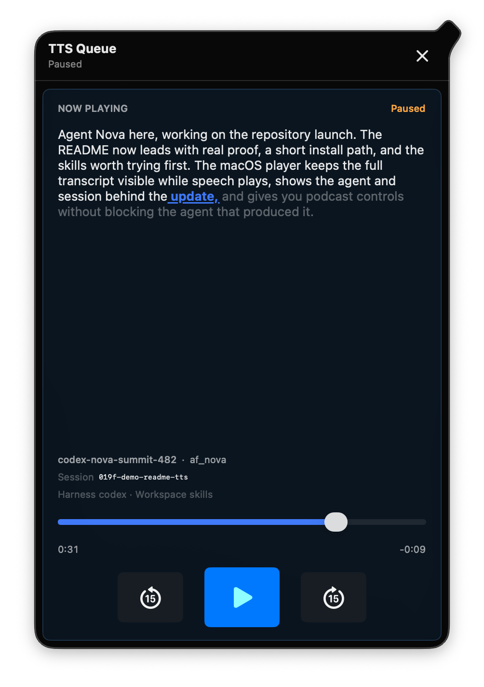

# TTS

## Hear what your agents are doing without watching every terminal

Agent work is increasingly parallel, but attention is still serial. Important updates arrive in panes, logs, notifications, and chat threads that all expect you to be looking at them.

`tts` gives those updates a shared audio surface. Each agent can finish a meaningful unit of work with a short spoken message, then return control immediately. The listener gets one orderly stream instead of overlapping voices or another queue of unread text.

<p align="center">
  
</p>

## The experience

The workflow owns more than text generation:

- The primary HTTP request and narrated attachment synthesis stay in the foreground until every requested speech asset is ready or has reported failure, so command completion remains trustworthy.
- Audible macOS requests appear in the TTS app as soon as synthesis starts. A pending row is marked with a progress indicator and opens a read-only preview of its durable text while audio is generated; the same view becomes the player when audio starts. Failures become retryable failed entries instead of getting stuck as pending.
- Successful audio moves into background playback only after that handshake.
- Every update is retained as a durable brief under `~/.agents/skills/tts/sessions/<session-id>/briefs/<item-id>/`, including its MP3, timing data, and any copied attachments.
- One resident macOS process serializes updates from every agent session.
- The normal macOS window identifies the subject, agent, Git project (or directory path outside Git), and progress. Linked worktrees keep the base repository as the primary project and add the differing checkout name as secondary context. When an update came from a live iTerm session, a header control selects that exact tab or split and brings iTerm forward; the control is absent for missing, unsupported, or ended sessions. The transcript sits beneath the context header, with the scrubber and playback controls below it.
- The TTS app uses normal macOS window controls: move, resize, minimize, close, and reopen it from the Dock or Window menu. The app menu includes Preferences and Quit.
- Preferences control how new asks request attention: never bounce the Dock icon, bounce once, or repeat at a chosen minute interval while an ask is pending. Native macOS notifications are separately opt-in.
- The transcript shows only the agent's message while the subject remains audible. It preserves paragraphs and lists, renders common Markdown structure, keeps a natural phrase softly in focus, and follows real synthesis timestamps with a stronger word playhead. Its prose geometry stays fixed, phrase following scrolls only when needed, and every mapped word seeks to its actual audio boundary.
- A brief can carry labeled attachments. The expanded player presents them in a compact accent-tinted rail: Markdown and text become optional narrated branches with readable previews, images open inline in the transcript surface, existing audio plays in context, and other files open in their default app. Supplemental narration returns to the main update at the saved position and never enters the ordinary queue until selected.
- An ask pairs a required primary spoken message with one or more optional questions in tabs. An optional `questions_preamble` is spoken after the update but stays out of the visual question interface; individual question titles and descriptions are never narrated. Every question carries a very short `short_title` for its tab and a full `title` for the content area. The player gives the main corpus the height it needs before scrolling. Suggestions stack vertically as radio choices or checkboxes, and both suggestions and freeform answers open the same modeless editor with explicit Cancel and Done actions plus compact attachment controls. Saved suggestion edits replace the option in place. Questions stay open after playback until explicitly resolved, retaining replay controls and clickable transcript seeking. The user submits every tab together; blank tabs become skips, while dropped answer files and final selected-suggestion titles and descriptions are returned to the asking agent.
- Agent name, voice, harness, workspace, and full session identifier make each update attributable.
- A required 5-to-10-word subject gives every update a spoken, scannable title in the player and queue.
- Pause, timeline scrubbing, 15-second seek, and replay make it behave like a small podcast queue rather than a fire-and-forget alert.
- A compact speed label on the floating player cycles through common playback rates and remembers the selected rate independently for each voice.
- History keeps an update at its original generation time even when replayed. Fresh updates use compact relative times for their first day, then an absolute timestamp. The native titlebar toolbar keeps search beside the history filter; the filter menu switches between recent and archived updates. Swipe left on an update to archive it, or restore it from the archived view.
- Preferences contain the local media-handoff settings, and `Command`+`,` opens them whenever the TTS app is active.
- Muted macOS system output automatically pauses TTS without losing its position. Playback resumes after unmute only when mute caused the pause, and the generator tells the agent that the queued speech was not audible.
- Media keeps playing during generation. Users can explicitly opt in to app-specific Music and Spotify handoff. TTS verifies the exact track before resuming it, restores an owned interruption during normal shutdown, and never changes volume, mute, or audio output routing.

The result is ambient awareness with provenance: you can hear that something changed, know which agent changed it, and revisit the exact words later.

## First spoken update

Configure a Kokoro-compatible endpoint, then run:

```bash
export KOKORO_API_ENDPOINT="https://<your-host>/v1/audio/speech"
./scripts/tts \
  --agent-name "<your-agent-id>" \
  --subject "The repository launch update is ready" \
  --message "The README update is ready for review. I attached the proposal and a mockup." \
  --attach "Architectural proposal" ./proposal.md \
  --attach "Mockup A" ./mockup-a.svg
```

Local generation is limited to two concurrent Kokoro requests across all TTS
processes sharing the same state directory. Change the limit under Generation
in the player's Settings window. `TTS_MAX_PARALLEL_GENERATIONS` remains
available as an explicit per-process override.

On macOS 13 or later with Swift available, the first audible request builds and starts the TTS app. The command returns after the primary message and narrated attachments finish generating and the item has been accepted for playback. Agent harnesses with asynchronous command execution may run the whole command that way, then wait on its execution handle for the final result.

Use `./scripts/tts-menu status` to inspect current playback and queue counts. Use `--no-play` when you only need the generated file; that command returns only after the file exists.

## MCP interface

`./scripts/tts-mcp` exposes the TTS workflow to standard MCP clients over
stdio. It can also serve authenticated Streamable HTTP on loopback:

```bash
export TTS_MCP_TOKEN="<at-least-24-random-characters>"
./scripts/tts-mcp --http --route automatic
```

Use `--route paired` when the MCP server runs on an agent host paired to the
computer that owns TTS playback. Spoken updates, questions, and generation-only
requests then travel through the existing signed paired channel. `tts_generate`
runs with no playback on the TTS computer, uploads the MP3 to
`https://blossom.primal.net`, and returns its hosted descriptor without leaking
the computer's local output path.

See [MCP setup and tool contracts](references/mcp.md).

## What it touches

`tts` sends the supplied message and narratable text attachments to the endpoint you configure. `tts_generate` also sends its generated MP3 to the configured Blossom server, which defaults to `blossom.primal.net`. It copies attachment sources and writes generated audio under `~/.agents/skills/tts/sessions`, and keeps queue state under `~/.local/state/tts`. On macOS, the player can pause and resume Music or Spotify according to an explicit local opt-in. Set `TTS_SESSIONS_ROOT` to override the durable brief location.

See [setup](references/setup.md) for endpoint configuration and [SKILL.md](SKILL.md) for the exact agent-facing writing and invocation rules.
